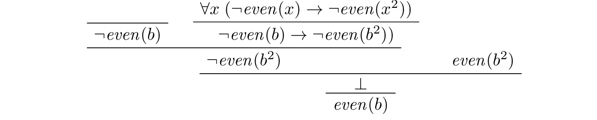

# 介绍

> 英文原文地址：<https://leanprover.github.io/logic_and_proof/introduction.html>  
> 授权于 Apache 2.0 协议

## 数学证明

尽管早在公元前 3000 年就存在埃及数学活动的文字证据，但许多学者依旧认为数学的诞生是在公元前大约 6 世纪，当时演绎证明法被首次引入的古希腊。亚里士多德认为米利都的泰勒斯（Thales of Miletus）不仅认识到了我们知道什么的重要性，还认识到了我们如何知道它的重要性，并在演绎法中找到了知识的依据。公元前 300 年左右，欧几里德在其著作 *《元素》* 中描述了几何学的演绎法。几个世纪以来，欧几里德的公理风格被认为是严格论证的典范，不仅在数学领域，在哲学和科学领域亦是如此。

这有一个用当代数学语言进行普通证明的例子。它确立了一个为毕达哥拉斯学派所知的事实。


---

**定理.** $\sqrt{2}$是无理数，也就是说，它不能表示为分数 $a/b$，其中 $a$ 和 $b$ 是整数。

**证明.** 假设 $\sqrt{2}=a/b$ 为某对整数 $a$ 和 $b$ 成立。通过去除所有公因数，我们可以假设 $a/b$ 是最简分数，也就是 $a$ 和 $b$ 不存在共同的因数。那么我们就有了 $a=\sqrt{2}b$，两侧平方，我们就有了 $a^2=2b^2$。

最后一个等式意味着 $a^2$ 是偶数，由于奇数的平方是奇数，$a$ 本身也必然是偶数。因此，对于某个整数 $c$，我们有 $a=2c$。将其代入方程 $a^2=2b^2$，我们有 $4c^2=2b^2$，因此有 $2c^2=b^2$。这意味着 $b^2$ 是偶数，因此 $b$ 也是偶数。

$a$ 和 $b$ 都是偶数与 $a$ 和 $b$ 没有共同因数的事实相矛盾。所以原来的假设 $\sqrt{2}=a/b$ 是错误的。

---


在下一个例子中，我们将将目光转向自然数，

$$
N=\left\{0,1,2,\cdots\right\}.
$$

如果一个大于或等于 2 的自然数 $n$ 可以写成 $n=m\cdot k$ 的乘积形式，其中 $m$ 和 $k$ 都不等于1，则就被称其为*合数*，否则被称为*素数*。需要注意的是，如果 $n=m \cdot k$ 证明了 $n$ 是合数的事实，那么 $m$ 和 $k$ 都比 $n$ 小。还要注意的是，按照惯例，0 和 1 既不被认为是素数，也不被认为是合数。

---

**定理.** 每一个大于或等于 2 的自然数可以被写成两个素数的乘积。

**证明.** 
我们对 $n$ 进行归纳。我们先让 $n$ 是一个任意比 2 大的自然数。如果 $n$ 是素数，那么我们就完成了证明；我们可以把 $n$ 本身看作是有一个项的积。否则，$n$ 是合数，我们则可以写成 $n=m\cdot k$，其中 $m$ 和 $k$ 都小于 $n$ 且大于 1。根据归纳假设，$m$ 和 $k$ 都可以写成素数的乘积，比如 $m=p_1\cdot p_2\cdot \cdots \cdot p_u$ 与 $k=q_1\cdot q_2\cdot \cdots \cdot q_v$。于是，我们有

$$
n=m\cdot k=p_1 \cdot p_2\cdot \cdots \cdot p_u \cdot q_1 \cdot q_2\cdot \cdots \cdot q_v,
$$

正如所需要的，素数们的乘积

---

稍后，我们将看到更多的事实：每个大于 2 的自然数都可以以独特的方式写成素数的乘积，这一事实被称为 *算术基本定理*。

本课程的第一个目标是教你写出清晰、可读的数学证明。我们将通过考虑一些例子来做到这一点，但也要从反思的角度出发：我们将仔细研究数学语言的组成部分和数学证明的结构，以便更好地了解它们是如何工作的。

本课程的第一个目标是教导你写出清晰、可读的数学证明。我们将通过考虑一些例子来做到这一点，但也要从反思的角度出发：我们将仔细研究数学语言的组成部分和数学证明的结构，以便更好地了解它们是如何工作的。

## 符号逻辑

为了理解证明是如何运作的，研究一个被称为“符号逻辑”的学科会有帮助，它提供了一个理想化的数学语言和证明模式。在 *《前分析篇》*中，古希腊哲学家着手分析推理的模式，并发展出了*三段论法*的理论。下面是一个三段论法的例子：

---

每个人都是一个动物。

每个动物都必然死亡。

因此，每个人必然死亡。

---

亚里士多德指出，这种推论的正确性与个别陈述的真假无关，而是与通用的模式有关：

---

每个 A 都是 B。

每个 B 都是 C。

因此，每个 A 都是 C。

---

我们可以用各种属性代替 A、B 和 C；可以试着用鱼、独角兽、游泳动物、神话中的生物等属性替代。由此产生的各种陈述可能是真的，也可能是假的，但所有的实例都有以下关键特征：如果两个假设都是真的，那么结论也是真的。我们称这种推论为*有效的*。

尽管亚里士多德的推理理论所涉及的语言模式是有限的，但我们要感谢他的一个重要见解：我们可以通过其逻辑形式对有效的推理模式进行分类，同时抽象出具体内容。正是这一基本观点支撑着整个符号逻辑领域。

在十七世纪，莱布尼茨提出设计一种*通用表意文字*，一种通用的符号语言，人们可以用这种语言精确地表达任何断言；还有一种*推理演算*，一种“思维的演算”，可以表达推理的精确规则。莱布尼茨本人采取了一些措施来发展这样一种语言和演算，在十九世纪，通过布尔、弗雷格、皮尔斯、施罗德等人的努力下，取得了更大的进展。二十世纪初，这些努力在数理逻辑领域开花结果。

如果你思考一下上一节中的证明例子，你会注意到一些术语和推理规则是特定于手头主题的，与数字和质数、合数、偶数、奇数等属性有关。但是还有其他非特定领域的术语和推理规则，例如与 “每一个”、“一些”、“与” 以及 “如果 ... 那么” 等词关的术语和规则。符号逻辑的目标是确定推理和论证的这些核心要素并解释它们如何工作，以及解释如何引入和使用更多特定领域的概念。

为此，我们将介绍关键逻辑概念的符号，包括以下内容：

- $A \to B$, "如果 $A$ 那么 $B$"
- $A \wedge B$, "$A$ 与 $B$"
- $A \vee B$, "$A$ 或 $B$"
- $\neg A$, "非 $A$"
- $\forall x A$, "对于所有 $x$, $A$"
- $\exists x A$, "对于一些 $x$, $A$"

然后我们将提供一个正式的证明系统，让我们以演绎的方式确定这些陈述之间的某些必然性是有效的。

我们将使用的证明系统是*自然演绎*的一个版本，这是 Gerhard Gentzen 在 1930 年代引入的一种证明系统，用来模拟非正式的论证方式。在这个系统中，判断的基本单位是一个陈述的断言 $A$，来自一个有限的假说集 $Gamma$。这被写成 $\Gamma\vdash A$。如果 $Gamma$ 和 $Delta$ 是两个有限的假说集，我们就写成 $\Gamma, \Delta$ 来表示这两个集的联合，也就是由每个集的所有假设说组成的集合。有了这些约定，合取符号的规则可以表达如下。


$$
\cfrac{\Gamma \vdash A \qquad \Delta \vdash B}{\Gamma, \Delta \vdash A \wedge B}
$$

这应该被解释为：假设 $A$ 来自假说 $\Gamma$，$B$ 来自假说 $\Delta$，$A\wedge B$ 来自假说 $\Gamma$ 和 $\Delta$。


我们可以更紧凑地写出这样的证明，让假说隐含在其中，所以上面的规则可以表示为：

$$
\cfrac{A \qquad B}{A \wedge B}
$$

在这种格式下，上一节中第一个证明的片段可能会以以下形式出现：




这种证明的复杂性很快就会失去控制，甚至初等数学事实的完整证明也会变得相当冗长。这样的系统不是为编写严谨的数学证明而设计的。相反，它们提供了数学推理的理想化模型，只要它们能捕捉到一些非正式证明的结构，它们就能使我们研究数学推理的特性。


本课程的第二个目标是作为形式演绎系统的一个例子，帮助你理解自然演绎。

## Interactive Theorem Proving

Early work in mathematical logic aimed to show that ordinary mathematical arguments could be modeled in symbolic calculi, at least in principle. As noted above, complexity issues limit the range of what can be accomplished in practice; even elementary mathematical arguments require long derivations that are hard to write and hard to read, and do little to promote understanding of the underlying mathematics.

Since the end of the twentieth century, however, the advent of computational proof assistants has begun to make complete formalization feasible. Working interactively with theorem proving software, users can construct formal derivations of complex theorems that can be stored and checked by computer. Automated methods can be used to fill in small gaps by hand, verify long calculations axiomatically, or fill in long chains of inferences deterministically. The reach of automation is currently fairly limited, however. The strategy used in interactive theorem proving is to ask users to provide just enough information for the system to be able to construct and check a formal derivation. This typically involves writing proofs in a sort of “programming language” that is designed with that purpose in mind. For example, here is a short proof in the *Lean* theorem prover:

```lean
section
variables (P Q : Prop)

theorem my_theorem : P ∧ Q → Q ∧ P :=
assume h : P ∧ Q,
have P, from and.left h,
have Q, from and.right h,
show Q ∧ P, from and.intro ‹Q› ‹P›

end
```

[try it!](https://leanprover-community.github.io/lean-web-editor/#code=section%0Avariables%20(P%20Q%20%3A%20Prop)%0A%0Atheorem%20my_theorem%20%3A%20P%20%E2%88%A7%20Q%20%E2%86%92%20Q%20%E2%88%A7%20P%20%3A%3D%0Aassume%20h%20%3A%20P%20%E2%88%A7%20Q%2C%0Ahave%20P%2C%20from%20and.left%20h%2C%0Ahave%20Q%2C%20from%20and.right%20h%2C%0Ashow%20Q%20%E2%88%A7%20P%2C%20from%20and.intro%20%E2%80%B9Q%E2%80%BA%20%E2%80%B9P%E2%80%BA%0A%0Aend)

If you are reading the present text in online form, you will find a button above the formal “proof script” that says “try it!” Pressing the button opens the proof in an editor window and runs a version of Lean inside your browser to process the proof, turn it into an axiomatic derivation, and verify its correctness. You can experiment by varying the text in the editor; any errors will be noted in the window to the right.

Proofs in Lean can access a library of prior mathematical results, all verified down to axiomatic foundations. A goal of the field of interactive theorem proving is to reach the point where any contemporary theorem can be verified in this way. For example, here is a formal proof that the square root of two is irrational, following the model of the informal proof presented above:

```lean
import data.nat.prime
open nat

theorem sqrt_two_irrational {a b : ℕ} (co : gcd a b = 1) :
  a^2 ≠ 2 * b^2 :=
assume h : a^2 = 2 * b^2,
have 2 ∣ a^2,
  by simp [h],
have 2 ∣ a,
  from prime.dvd_of_dvd_pow prime_two this,
exists.elim this $
assume (c : nat) (aeq : a = 2 * c),
have 2 * (2 * c^2) = 2 * b^2,
  by simp [eq.symm h, aeq];
    simp [pow_succ', mul_comm, mul_assoc, mul_left_comm],
have 2 * c^2 = b^2,
  from mul_left_cancel' dec_trivial this,
have 2 ∣ b^2,
  by simp [eq.symm this],
have 2 ∣ b,
  from prime.dvd_of_dvd_pow prime_two this,
have 2 ∣ gcd a b,
  from dvd_gcd ‹2 ∣ a› ‹2 ∣ b›,
have 2 ∣ (1 : ℕ),
  by simp * at *,
show false, from absurd ‹2 ∣ 1› dec_trivial
```

[try it!](https://leanprover-community.github.io/lean-web-editor/#code=import%20data.nat.prime%0Aopen%20nat%0A%0Atheorem%20sqrt_two_irrational%20%7Ba%20b%20%3A%20%E2%84%95%7D%20(co%20%3A%20gcd%20a%20b%20%3D%201)%20%3A%0A%20%20a%5E2%20%E2%89%A0%202%20*%20b%5E2%20%3A%3D%0Aassume%20h%20%3A%20a%5E2%20%3D%202%20*%20b%5E2%2C%0Ahave%202%20%E2%88%A3%20a%5E2%2C%0A%20%20by%20simp%20%5Bh%5D%2C%0Ahave%202%20%E2%88%A3%20a%2C%0A%20%20from%20prime.dvd_of_dvd_pow%20prime_two%20this%2C%0Aexists.elim%20this%20%24%0Aassume%20(c%20%3A%20nat)%20(aeq%20%3A%20a%20%3D%202%20*%20c)%2C%0Ahave%202%20*%20(2%20*%20c%5E2)%20%3D%202%20*%20b%5E2%2C%0A%20%20by%20simp%20%5Beq.symm%20h%2C%20aeq%5D%3B%0A%20%20%20%20simp%20%5Bpow_succ'%2C%20mul_comm%2C%20mul_assoc%2C%20mul_left_comm%5D%2C%0Ahave%202%20*%20c%5E2%20%3D%20b%5E2%2C%0A%20%20from%20mul_left_cancel'%20dec_trivial%20this%2C%0Ahave%202%20%E2%88%A3%20b%5E2%2C%0A%20%20by%20simp%20%5Beq.symm%20this%5D%2C%0Ahave%202%20%E2%88%A3%20b%2C%0A%20%20from%20prime.dvd_of_dvd_pow%20prime_two%20this%2C%0Ahave%202%20%E2%88%A3%20gcd%20a%20b%2C%0A%20%20from%20dvd_gcd%20%E2%80%B92%20%E2%88%A3%20a%E2%80%BA%20%E2%80%B92%20%E2%88%A3%20b%E2%80%BA%2C%0Ahave%202%20%E2%88%A3%20(1%20%3A%20%E2%84%95)%2C%0A%20%20by%20simp%20*%20at%20*%2C%0Ashow%20false%2C%20from%20absurd%20%E2%80%B92%20%E2%88%A3%201%E2%80%BA%20dec_trivial)

The third goal of this course is to teach you to write elementary proofs in Lean. The facts that we will ask you to prove in Lean will be more elementary than the informal proofs we will ask you to write, but our intent is that formal proofs will model and clarify the informal proof strategies we will teach you.

## The Semantic Point of View

As we have presented the subject here, the goal of symbolic logic is to specify a language and rules of inference that enable us to get at the truth in a reliable way. The idea is that the symbols we choose denote objects and concepts that have a fixed meaning, and the rules of inference we adopt enable us to draw true conclusions from true hypotheses.

One can adopt another view of logic, however, as a system where some symbols have a fixed meaning, such as the symbols for “and,” “or,” and “not,” and others have a meaning that is taken to vary. For example, the expression P∧($Q \vee R$), read “$P$ and either $Q$ or $R$,” may be true or false *depending on the basic assertions that $P$, $Q$, and $R$ stand for*. More precisely, the truth of the compound expression depends only on whether the component symbols denote expressions that are true or false. For example, if $P$, $Q$, and $R$ stand for “seven is prime,” “seven is even,” and “seven is odd,” respectively, then the expression is true. If we replace “seven” by “six,” the statement is false. More generally, the expression comes out true whenever $P$ is true and at least one of $Q$ and $R$ is true, and false otherwise.

From this perspective, logic is not so much a language for asserting truth, but a language for describing possible states of affairs. In other words, logic provides a specification language, with expressions that can be true or false depending on how we interpret the symbols that are allowed to vary. For example, if we fix the meaning of the basic predicates, the statement “there is a red block between two blue blocks” may be true or false of a given “world” of blocks, and we can take the expression to describe the set of worlds in which it is true. Such a view of logic is important in computer science, where we use logical expressions to select entries from a database matching certain criteria, to specify properties of hardware and software systems, or to assert constraints that we would like a constraint solver to satisfy.

There are important connections between the syntactic / deductive point of view on the one hand, and the semantic / model-theoretic point of view on the other. We will explore some of these along the way. For example, we will see that it is possible to view the “valid” assertions as those that are true under all possible interpretations of the non-fixed symbols, and the “valid” inferences as those that maintain truth in all possible states and affairs. From this point of view, a deductive system should only allow us to derive valid assertions and entailments, a property known as *soundness*. If a deductive system is strong enough to allow us to verify *all* valid assertions and entailments, it is said to be *complete*.

The fourth goal of this course is to convey the semantic view of logic, and to lead you to understand how logical expressions can be used to specify states of affairs.

## Goals Summarized

To summarize, these are the goals of this course:

- You should learn to write clear, “literate,” mathematical proofs.
- You should become comfortable with symbolic logic and the formal modeling of deductive proof.
- You should learn how to use an interactive proof assistant.
- You should understand how to use logic as a precise language for making claims about systems of objects and the relationships between them, and specifying certain states of affairs.

Let us take a moment to consider the relationship between some of these goals. It is important not to confuse the first three. We are dealing with three kinds of mathematical language: ordinary mathematical language, the symbolic representations of mathematical logic, and computational implementations in interactive proof assistants. These are very different things!

Symbolic logic is not meant to replace ordinary mathematical language, and you should not use symbols like $\wedge$ and $\vee$ in ordinary mathematical proofs any more than you would use them in place of the words “and” and “or” in letters home to your parents. Natural languages provide nuances of expression that can convey levels of meaning and understanding that go beyond pattern matching to verify correctness. At the same time, modeling mathematical language with symbolic expressions provides a level of precision that makes it possible to turn mathematical language itself into an object of study. Each has its place, and we hope to get you to appreciate the value of each without confusing the two.

The proof languages used by interactive theorem provers lie somewhere between the two extremes. On the one hand, they have to be specified with enough precision for a computer to process them and act appropriately; on the other hand, they aim to capture some of the higher-level nuances and features of informal language in a way that enables us to write more complex arguments and proofs. Rooted in symbolic logic and designed with ordinary mathematical language in mind, they aim to bridge the gap between the two.

This book also aims to show you how mathematics is built up from fundamental concepts. Logic provides the rules of the game, and then we work our way up from properties of sets, relations, functions, and the natural numbers to elementary number theory, combinatorics, and properties of the real numbers. The last chapter rounds out the story with a discussion of axiomatic foundations.

## 关于这本教科书

这本在线教科书和 *Lean* 定理检验器都是全新的并且正在进行的项目。你可以从它的[项目页面](http://leanprover.github.io/)、Lean [社区页面](http://leanprover-community.github.io/)和在线教科书[Lean的定理证明（Theorem Proving in Lean）](http://leanprover.github.io/theorem_proving_in_lean/)中了解更多关于Lean的信息。

我们非常感谢一些人的反馈和更正，包括 Bruno Cuconato, William DeMeo, Tobias Grosser, Lyle Kopnicky, Alexandre Rademaker, Matt Rice 和 Jason Siefken。